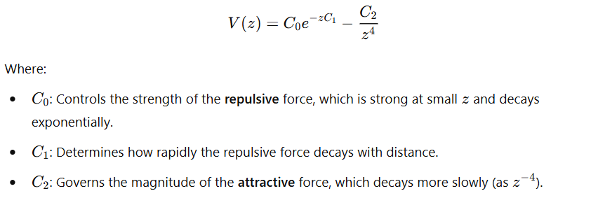
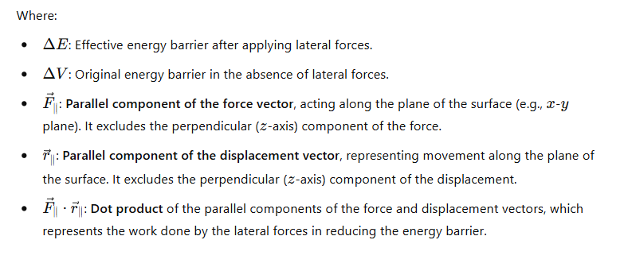

# **TrajectorySim: Potential Energy Surface and Diffusion Simulation**

**TrajectorySim** is a Python-based simulation program designed to model the behavior of atoms diffusing on a **Potential Energy Surface (PES)**. The program calculates energy and forces, evaluates interaction energy, and simulates atomic trajectories using the **velocity Verlet algorithm** and **Langevin equation**.

---

## **Overview**

Simulating atomic diffusion on surfaces can be computationally expensive due to the long timescales involved. Atoms typically remain in stable positions (PES minima) and occasionally jump to neighboring sites, overcoming potential barriers.

To accelerate this process, **TrajectorySim** applies random lateral forces that lower the energy barriers, enabling faster transitions while maintaining realistic dynamics.


---

## **Theoretical Background**

### **1. Potential Energy Surface (PES)**

The Potential Energy Surface (PES) describes the energy experienced by an atom as it interacts with a surface. For the purpose of simulating atomic diffusion, we focus on the vertical distance 𝑧 between the atom and the surface, as this governs the strength of both the repulsive and attractive interactions.
The potential energy as a function of 𝑧 is given by:




The two terms represent the repulsion and attraction (like Van der Waals) contribution. The numerical values for these parameters C0,C1, and C2, as used in this simulation, are derived from the work of Reguzzoni et al. In their study of the graphene-graphene interaction. **DOI:** [10.1103/PhysRevB.86.245434](https://doi.org/10.1103/PhysRevB.86.245434).


#### **AA vs. AB Stacking Configurations:**

 **AA Stacking (Max Interaction):**  
In this configuration the graphene layers are perfectly aligned, resulting in stronger repulsive and attractive interactions at all separations. This configuration leads to a lower energy state at smaller separations. 


 **AB Stacking (Min Interaction):**
Here the graphene layers are offset, resulting in weaker interactions. Both the repulsive and attractive forces are less intense compared to AA stacking.


*<small>This figure shows the Potential Energy Surface (PES) for bilayer graphene, is represented in 2D for two different values of the interlayer separation z. The bilayer configurations corresponding to the PES stationary points are represented in the top part of the picture.with AA stacking on the left (stronger interaction-C_max), the saddle point in the middle (transition state), and AB stacking on the right (weaker interaction,C min), as described by Reguzzoni et al. (2012).</small>*

The saddle point represents the energy barrier an atom must overcome to transition between the both stacking configurations.

### **2. The Importance of Interaction Energy in the Simulation**

The interaction energy between two graphene layers plays a crucial role in simulating atomic motion on the surface. This energy is defined by the PES as it's mentioned before. These forces govern how atoms interact and move across the surface.

**In this program two results will be present related to this factor, they show:**

#### a. **Interaction Energy vs. Separation Distance:**
 The interaction energy varies with the vertical separation z, balancing repulsive forces at short separations and attractive Van der Waals forces at larger separations. In AA stacking, the interaction energy is stronger, indicating a more stable configuration, while in AB stacking, the interaction is weaker, reflecting a less stable configuration.
 


#### b. **Interaction Energy Along the Surface:**
This shows how the interaction energy changes across the surface at different heights. At lower separations, the energy shows stronger interactions, while at higher separations, it becomes more uniform.


### **2. Diffusion on a PES**

Atoms on a Potential Energy Surface (PES) tend to stay in low-energy regions, such as hollow sites, where they are most stable. For an atom to move to a neighboring site, it must overcome an energy barrier. This natural diffusion process is typically slow because:

* The atom spends most of its time vibrating within the energy minima. 
* Transitions to neighboring sites occur infrequently, as they require significant thermal activation. 

To accelerate diffusion, this project introduces lateral forces, which effectively lower the energy barriers, making transitions more frequent. The reduced energy barrier is described by the equation:



This formulation ensures that lateral forces assist atomic transitions by lowering the energy barriers, facilitating faster diffusion.

### **3. Velocity Verlet Algorithm**
To compute the atom's motion, the Velocity Verlet algorithm is used for integration. This method updates the atom's position, velocity, and acceleration iteratively, through these steps:


Here, \(r(t)\) and \(v(t)\) are the particle's position and velocity at time \(t\), \(F(t)\) is the force acting on the particle at time \(t\), \(m\) is the particle’s mass, \(Delta t\) is the time step, and \(v(t')\) is the intermediate velocity after the first update.


### **4. Langevin Dynamics**

The motion of the atom is influenced by:
1. **Deterministic Forces:**  Derived from the PES gradients.
2. **Random Forces (Thermal Noise):**  Represented as random fluctuations to mimic thermal effects.
3. **Friction:**  Damps the motion to ensure realistic behavior.

These effects are modeled using the Langevin Equation to simulate realistic atomic motion:


### **5. Applications**

This simulation is useful for:
- Understanding atomic diffusion on surfaces like graphene.
- Exploring the effects of thermal noise and external forces on atomic motion.
- Validating potential energy models derived from experimental or ab initio data.


---

## **Visualization of some of the results of the program:** 
  The program generates plots for:
 
- **PES Calculation:** 
 
 
 
It computes the potential energy landscape for an atom on a surface.

- **Interaction Energy:** 


These energy profiles help define the forces that affect atomic motion in the simulation, allowing it to model how atoms move, overcome energy barriers and transition between stable positions on the surface.

- **Force Computation:** 


Derives force components \(Fx, Fy, Fz) from the PES gradients.
  
- **Trajectory Simulation:** 


 Simulates atomic motion using the velocity Verlet algorithm and Langevin equation. Adds thermal noise and friction for realistic dynamics.

---
## **Installation**

1. Clone the repository:

   ```bash
   
   git clone https://github.com/Mohamed-mahi/TrajectorySim.git
   cd TrajectorySim

2. Install Dependencies

   Install required libraries using ```requirements.txt```:

   ```bash 
   pip install -r requirements.txt
   ```
  
3. Verify the Installation
   Check that the program is ready by running:

   ```python    
   python main.py --help 
   ```
